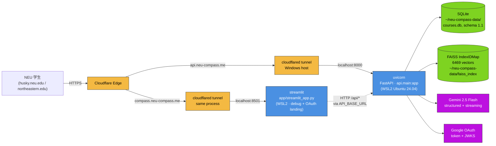
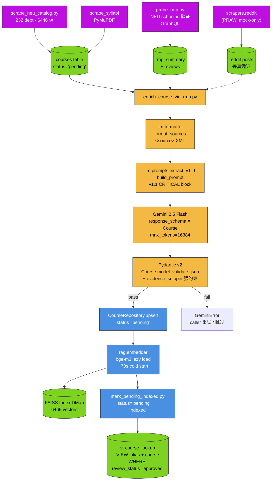
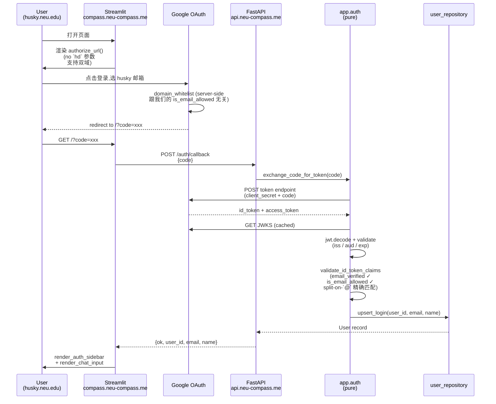
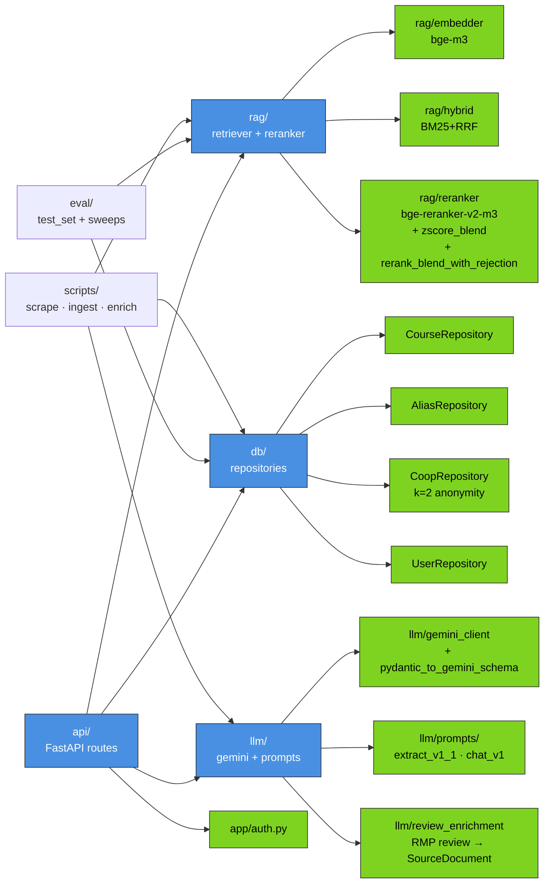

# NEU-Compass · System Architecture

> **Updated**: 2026-05-05 (Week 8 portfolio packaging, PLAN v2.3 §3.7)
> **Source of truth**: `README.md` ASCII 简版 + 本文 mermaid 详版。
> **Render to PNG**: `docs/system_architecture.png` (mermaid CLI 转,见 §6)。

四张图,各管一面:
1. Public-facing topology — 公网入口怎么到 WSL 进程
2. Query path — `/search` 调用从 alias 到 reranker 的全链
3. Data path — scraper → Gemini → SQLite → FAISS 的 ingestion pipeline
4. Auth flow — Google OAuth + JWT verify + domain whitelist

---

## 1. Public-facing topology



**Why double subdomain (Week 7 §3.1 lesson)**: cloudflared 不支持 strip path-prefix。
单域 + `/api/*` 路径会让 uvicorn 收到 `/api/health` 找不到路由。双子域 = FastAPI 路径不动,
DNS 最便宜的 routing 解。

**Why WSL 跑代码 / 数据**: ADR-0014 — H 盘 SQLite 写慢 77x,WSL home (ext4) 是必经路径。

---

## 2. Query path: /search

```mermaid
flowchart TD
    Query[POST /search<br/>{q, top_k=5}] --> Norm[query_normalizer<br/>regex + lowercase]
    Norm --> Alias{AliasRepository.resolve<br/>via v_course_lookup<br/>review_status='approved'}

    Alias -->|hit| AliasReturn[matched_via='alias'<br/>direct Course return<br/>~3 ms p50]
    Alias -->|miss| Hybrid[HybridRetriever<br/>pool_size=20]

    Hybrid --> Vec[Vector leg<br/>bge-m3 → FAISS]
    Hybrid --> BM25[BM25 leg<br/>rank_bm25<br/>+110 stopwords filter]

    Vec --> RRF[RRF fusion k=60]
    BM25 --> RRF

    RRF --> Rehydrate[SQLite rehydrate<br/>WHERE status='indexed']
    Rehydrate --> Reranker[bge-reranker-v2-m3<br/>cross-encoder, single pass]

    Reranker --> Reject{max sigmoid<br/>< 0.05?<br/>ADR-0016}

    Reject -->|yes| Rejected[matched_via='rejected'<br/>+ rejection_reason<br/>e.g. CS 0001 / nonsense]
    Reject -->|no| Blend[Z-score blend<br/>α=0.4 · z_rrf<br/>+ 0.6 · z_rerank<br/>ADR-0015]

    Blend --> SortHits[sort desc → top-k<br/>SearchHit list]
    SortHits --> Out[matched_via='hybrid'<br/>~47 ms p50<br/>~51 ms p95]

    classDef alias fill:#7ed321,stroke:#333,color:#000
    classDef hybrid fill:#4a90e2,stroke:#333,color:#fff
    classDef decision fill:#f4b942,stroke:#333,color:#000
    classDef terminal fill:#bd10e0,stroke:#333,color:#fff
    class Alias,Reject decision
    class AliasReturn,Rejected,Out terminal
    class Hybrid,RRF,Reranker,Blend hybrid
```

**Decision points**:
- **Alias hit early-exit** (~3 ms): "AAI 6600" / "5800" / "Algo" 等代码或 slang 命中 → 跳过整个 hybrid。Boundary R@5 = 6/6 实测。
- **Rerank reject T=0.05** (ADR-0016): max sigmoid < 0.05 视为"无好答案",显式返回 rejected。4/4 adversarial 命中,误拒 4/38 真 query 都是本身 R@5=0 的 query。
- **Z-blend α=0.4** (ADR-0015): R@5 0.621 / MRR 0.575,两个 baseline 都比单一 RRF / 单一 reranker 好,只是不到双 Pareto。

---

## 3. Data path: ingestion + indexing



**Invariants** (ADR-0013):
- **SQLite 是真相源**;FAISS 可从 SQLite 重建(`rebuild_faiss.py --all`)
- **status='pending'** = 已抽取未 embed;**status='indexed'** = 已 embed 可检索
- **`v_course_lookup` filter `review_status='approved'`** — 未审核的 LLM 别名永不影响检索

**Cost discipline**: Gemini 2.5 Flash ~$0.05 / 课 enrich,3-course Week 7 smoke 总 < $0.20 (PLAN §8 budget cap)。Week 8 §3.4 扩 16 课 ≈ $0.80。

---

## 4. Auth flow: Google OAuth + JWT verify + domain whitelist



**Security boundaries** (PLAN §3.6):
- **`is_email_allowed` 走 split-on-`@` 精确匹配** — 禁止子串攻击 (`attacker@husky.neu.edu.evil.com` 必拒)
- **JWKS cache**: `lru_cache(maxsize=1)` 进程内缓存 Google JWKS;生产应在签名失败时强制刷新(MVP 接受)
- **State token**: dev 可空,production MUST 用 per-request 随机 token + 验证(CSRF 防御)
- **F1 合规**: OAuth 域名白名单 = husky.neu.edu / northeastern.edu only,**禁止商业化**

---

## 5. Cross-cutting concerns

### Module dependency (high-level)



### Test suite topology

| 层 | 文件数 | 测试数 | 范围 |
|---|---:|---:|---|
| schemas | 4 | ~80 | Course / Alias / Coop / User Pydantic |
| db | 5 | ~120 | 各 Repository CRUD + UNIQUE / FK / cascade |
| rag | 5 | ~140 | embedder / hybrid / reranker / blend / reject |
| llm | 4 | ~85 | prompts / gemini_client schema / formatter / review_enrichment |
| api | 6 | ~110 | routes + dependency override + OAuth callback |
| scrapers | 3 | ~60 | rmp / catalog / reddit (mock) |
| eval | 3 | ~36 | test_set / run_eval / sweep wiring |
| **合计** | **30** | **631** | **~12s on WSL2 + RTX 5090** |

实际数字以 `uv run pytest tests/ -q` 输出为准(目前 631 passed)。

---

## 6. Render to PNG

```bash
# 一次性装 mermaid CLI
npm install -g @mermaid-js/mermaid-cli

# 转每图
for n in topology query data auth modules; do
  mmdc -i docs/system_architecture.md \
       -o docs/system_architecture_$n.png \
       --pdfFit \
       --backgroundColor white
done

# 或一次合并 PDF
mmdc -i docs/system_architecture.md \
     -o docs/system_architecture.pdf
```

PLAN v2.3 §6.2 deliverable 列表里 `docs/system_architecture.png` 是 portfolio screenshot 用,放 README 顶部 hero 区。

---

## 7. 修订历史

- 2026-05-05: 初版 (PLAN v2.3 §3.7,Week 8 portfolio packaging)
- 后续: v0.3 test_set 落地后,在 §2 query path 上标真数字(R@5 / MRR);Ragas 跑完后加 §8 quality metrics 章节
